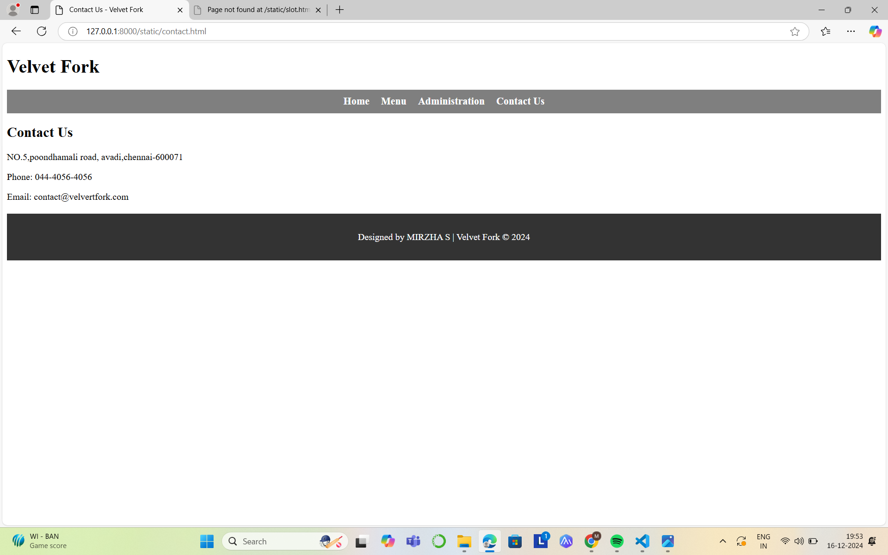
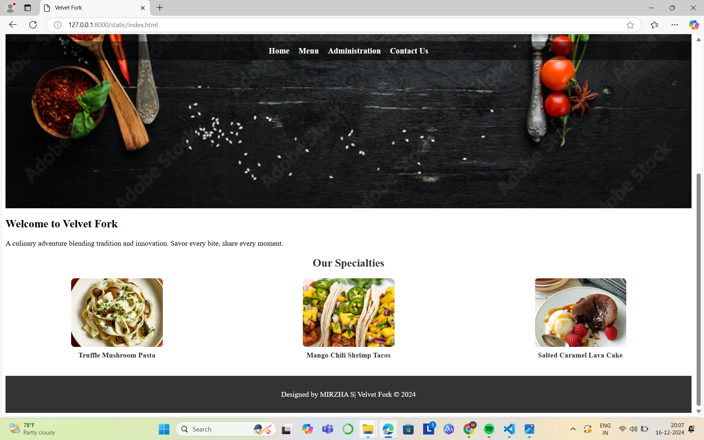
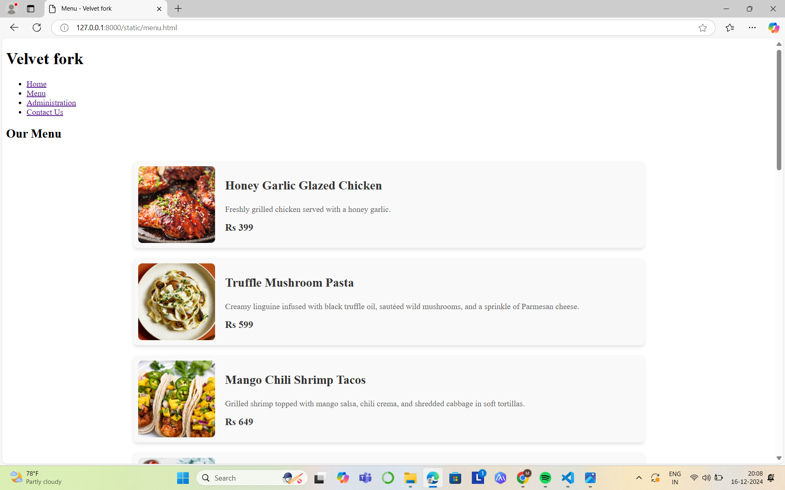
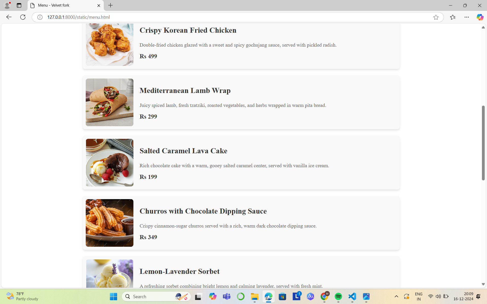
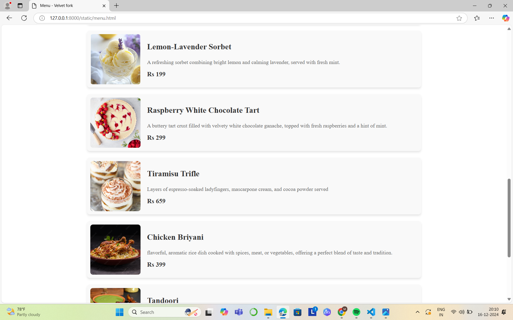
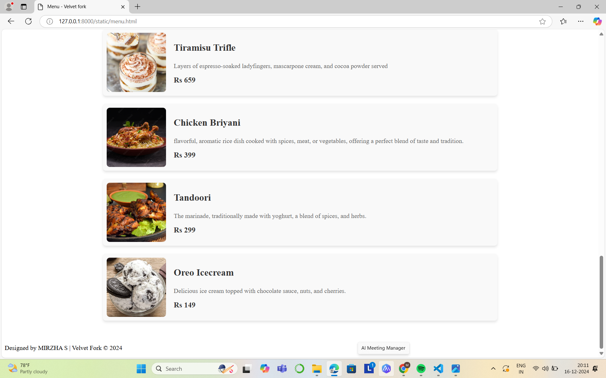
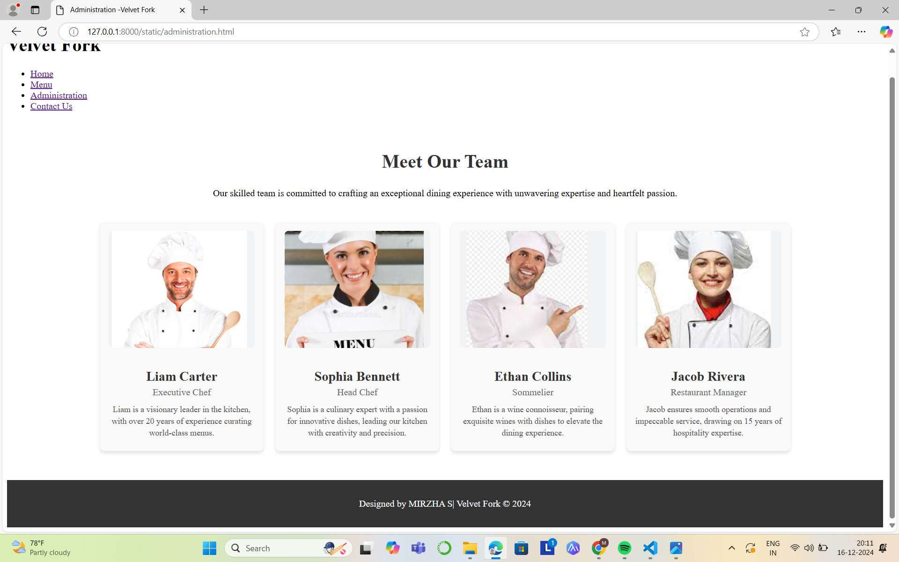
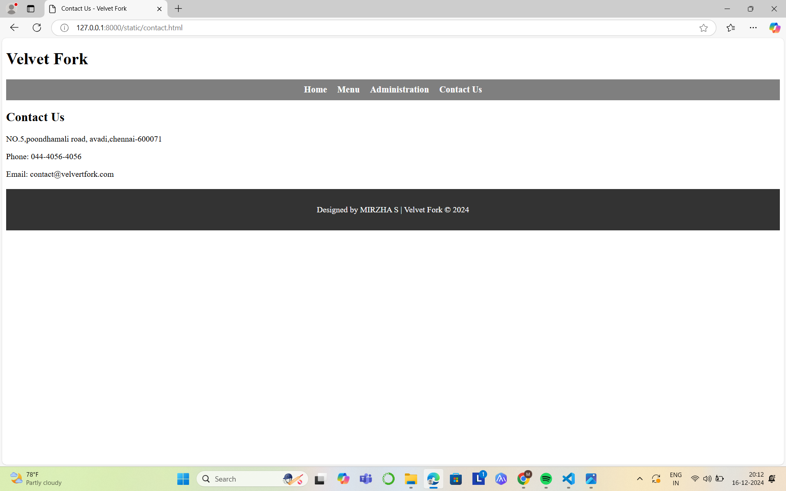

# Ex.07 Restaurant Website
## Date:

## AIM:
To develop a static Restaurant website to display the food items and services provided by them.

## DESIGN STEPS:

### Step 1:
Requirement collection.

### Step 2:
Creating the layout using HTML and CSS.

### Step 3:
Updating the sample content.

### Step 4:
Choose the appropriate style and color scheme.

### Step 5:
Validate the layout in various browsers.

### Step 6:
Validate the HTML code.

### Step 7:
Publish the website in the given URL.

## PROGRAM:
```
administration.html
<!DOCTYPE html>
<html lang="en">
<head>
    <meta charset="UTF-8">
    <meta name="viewport" content="width=device-width, initial-scale=1.0">
    <title>Administration -Velvet Fork</title>
    <link rel="stylesheet" href="sty.css">
</head>
<body>
    <header>
        <div class="banner">
            <h1>Velvet Fork</h1>
        </div>
        <nav>
            <ul>
                <li><a href="index.html">Home</a></li>
                <li><a href="menu.html">Menu</a></li>
                <li><a href="administration.html">Administration</a></li>
                <li><a href="contact.html">Contact Us</a></li>
            </ul>
        </nav>
    </header>
    <main>
        <div class="admin-container">
            <div class="admin-header">
                <h2>Meet Our Team</h2>
                <p>Our skilled team is committed to crafting an exceptional dining experience with unwavering expertise and heartfelt passion.</p>
            </div>
            <div class="admin-grid">
                <!-- Team Member 1 -->
                <div class="admin-card">
                    
                    <h3>Liam Carter</h3>
                    <p> Executive Chef</p>
                    <p class="experience">Liam is a visionary leader in the kitchen, with over 20 years of experience curating world-class menus.</p>
                </div>
                <!-- Team Member 2 -->
                <div class="admin-card">
                    
                    <h3>Sophia Bennett</h3>
                    <p>Head Chef</p>
                    <p class="experience">Sophia is a culinary expert with a passion for innovative dishes, leading our kitchen with creativity and precision.</p>
                </div>
                <!-- Team Member 3 -->
                <div class="admin-card">
                    
                    <h3>Ethan Collins</h3>
                    <p>Sommelier</p>
                    <p class="experience">Ethan is a wine connoisseur, pairing exquisite wines with dishes to elevate the dining experience.</p>
                </div>
                <!-- Team Member 4 -->
                <div class="admin-card">
                    
                    <h3>Jacob Rivera</h3>
                    <p>Restaurant Manager</p>
                    <p class="experience">Jacob ensures smooth operations and impeccable service, drawing on 15 years of hospitality expertise.</p>
                </div>
            </div>
        </div>
    </main>
    <footer>
        <p>Designed by MIRZHA S| Velvet Fork © 2024</p>
    </footer>
</body>
</html>

index.html

<!DOCTYPE html>
<html lang="en">
<head>
    <meta charset="UTF-8">
    <meta name="viewport" content="width=device-width, initial-scale=1.0">
    <title>Velvet Fork</title>
    <link rel="stylesheet" href="styles.css">
</head>
<body>
    <header class="home-header">
        <div class="banner">
            <h1>Velvet Fork</h1>
            <p>Crafting Memories, One Bite at a Time</p>
        </div>
        <nav>
            <ul>
                <li><a href="index.html">Home</a></li>
                <li><a href="menu.html">Menu</a></li>
                <li><a href="administration.html">Administration</a></li>
                <li><a href="contact.html">Contact Us</a></li>
            </ul>
        </nav>
    </header>
    <main>
        <section class="welcome">
            <h2>Welcome to Velvet Fork</h2>
            <p>A culinary adventure blending tradition and innovation. Savor every bite, share every moment.</p>
        </section>
        <section class="featured">
            <h2>Our Specialties</h2>
            <div class="featured-items">
                <div class="featured-item">
                    
                    <p>Truffle Mushroom Pasta</p>
                </div>
                <div class="featured-item">
                    
                    <p>Mango Chili Shrimp Tacos</p>
                </div>
                <div class="featured-item">
                    
                    <p> Salted Caramel Lava Cake</p>
                </div>
            </div>
        </section>
    </main>
    <footer>
        <p>Designed by MIRZHA S| Velvet Fork © 2024</p>
    </footer>
</body>
</html>

menu.html

<!DOCTYPE html>
<html lang="en">
<head>
    <meta charset="UTF-8">
    <meta name="viewport" content="width=device-width, initial-scale=1.0">
    <title>Menu - Velvet fork</title>
    <link rel="stylesheet" href="styless.css">
</head>
<body>
    <header>
        <div class="banner">
            <h1>Velvet fork</h1>
        </div>
        <nav>
            <ul>
                <li><a href="index.html">Home</a></li>
                <li><a href="menu.html">Menu</a></li>
                <li><a href="administration.html">Administration</a></li>
                <li><a href="contact.html">Contact Us</a></li>
            </ul>
        </nav>
    </header>
    <main>
        <h2>Our Menu</h2>
        <div class="menu-card">
            <div class="menu-item">
                
                <div class="menu-details">
                    <h3> Honey Garlic Glazed Chicken</h3>
                    <p>Freshly grilled chicken served with a honey garlic.</p>
                    <p class="price">Rs 399</p>
                </div>
            </div>
            <div class="menu-item">
                
                <div class="menu-details">
                    <h3>Truffle Mushroom Pasta</h3>
                    <p>Creamy linguine infused with black truffle oil, sautéed wild mushrooms, and a sprinkle of Parmesan cheese.</p>
                    <p class="price">Rs 599</p>
                </div>
            </div>
            <div class="menu-item">
                
                <div class="menu-details">
                    <h3>Mango Chili Shrimp Tacos</h3>
                    <p>Grilled shrimp topped with mango salsa, chili crema, and shredded cabbage in soft tortillas.</p>
                    <p class="price">Rs 649</p>
                </div>
            </div>
            <div class="menu-item">
                
                <div class="menu-details">
                    <h3>Crispy Korean Fried Chicken</h3>
                    <p>Double-fried chicken glazed with a sweet and spicy gochujang sauce, served with pickled radish.</p>
                    <p class="price">Rs 499</p>
                </div>
            </div>
            <div class="menu-item">
                
                <div class="menu-details">
                    <h3>Mediterranean Lamb Wrap</h3>
                    <p>Juicy spiced lamb, fresh tzatziki, roasted vegetables, and herbs wrapped in warm pita bread.</p>
                    <p class="price">Rs 299</p>
                </div>
            </div>
            <div class="menu-item">
                
                <div class="menu-details">
                    <h3>Salted Caramel Lava Cake</h3>
                    <p>Rich chocolate cake with a warm, gooey salted caramel center, served with vanilla ice cream.</p>
                    <p class="price">Rs 199</p>
                </div>
            </div>
            <div class="menu-item">
                
                <div class="menu-details">
                    <h3> Churros with Chocolate Dipping Sauce</h3>
                    <p>Crispy cinnamon-sugar churros served with a rich, warm dark chocolate dipping sauce.</p>
                    <p class="price">Rs 349</p>
                </div>
            </div>
            <div class="menu-item">
                
                <div class="menu-details">
                    <h3> Lemon-Lavender Sorbet</h3>
                    <p>A refreshing sorbet combining bright lemon and calming lavender, served with fresh mint.</p>
                    <p class="price">Rs 199</p>
                </div>
            </div>
            <div class="menu-item">
                
                <div class="menu-details">
                    <h3> Raspberry White Chocolate Tart</h3>
                    <p>A buttery tart crust filled with velvety white chocolate ganache, topped with fresh raspberries and a hint of mint.

                    </p>
                    <p class="price">Rs 299</p>
                </div>
            </div>
            <div class="menu-item">
                
                <div class="menu-details">
                    <h3>Tiramisu Trifle</h3>
                    <p>Layers of espresso-soaked ladyfingers, mascarpone cream, and cocoa powder served</p>
                    <p class="price">Rs 659</p>
                </div>
            </div>
            <div class="menu-item">
                
                <div class="menu-details">
                    <h3>Chicken Briyani</h3>
                    <p> flavorful, aromatic rice dish cooked with spices, meat, or vegetables, offering a perfect blend of taste and tradition.</p>
                    <p class="price">Rs 399</p>
                </div>
            </div>
            <div class="menu-item">
                
                <div class="menu-details">
                    <h3>Tandoori</h3>
                    <p>The marinade, traditionally made with yoghurt, a blend of spices, and herbs.</p>
                    <p class="price">Rs 299</p>
                </div>
            </div>
            <div class="menu-item">
                
                <div class="menu-details">
                    <h3>Oreo Icecream</h3>
                    <p>Delicious ice cream topped with chocolate sauce, nuts, and cherries.</p>
                    <p class="price">Rs 149</p>
                </div>
            </div>
        </div>
    </main>
    <footer>
        <p>Designed by MIRZHA S | Velvet Fork © 2024</p>
    </footer>
</body>
</html>

contact.html
<!DOCTYPE html>
<html lang="en">
<head>
    <meta charset="UTF-8">
    <meta name="viewport" content="width=device-width, initial-scale=1.0">
    <title>Contact Us - Velvet Fork</title>
    <link rel="stylesheet" href="styles.css">
</head>
<body>
    <header>
        <div class="banner">
            <h1>Velvet Fork</h1>
        </div>
        <nav>
            <ul>
                <li><a href="index.html">Home</a></li>
                <li><a href="menu.html">Menu</a></li>
                <li><a href="administration.html">Administration</a></li>
                <li><a href="contact.html">Contact Us</a></li>
            </ul>
        </nav>
    </header>
    <main>
        <h2>Contact Us</h2>
        <p>NO.5,poondhamali road, avadi,chennai-600071</p>
        <p>Phone: 044-4056-4056</p>
        <p>Email: contact@velvertfork.com</p>
    </main>
    <footer>
        <p>Designed by MIRZHA S | Velvet Fork © 2024</p>
    </footer>
</body>
</html>

sty.css
/* Administration Page */
.admin-container {
    max-width: 1200px;
    margin: 20px auto;
    padding: 20px;
}

.admin-header {
    text-align: center;
    margin-bottom: 30px;
}

.admin-header h2 {
    font-size: 2em;
    color: #333;
}

.admin-grid {
    display: grid;
    grid-template-columns: repeat(auto-fit, minmax(250px, 1fr)); /* Responsive columns */
    gap: 20px;
    padding: 10px;
}

.admin-card {
    text-align: center;
    background: #f9f9f9;
    border-radius: 8px;
    box-shadow: 0 4px 6px rgba(0, 0, 0, 0.1);
    padding: 15px;
    transition: transform 0.2s;
}

.admin-card:hover {
    transform: scale(1.05); /* Subtle zoom on hover */
}

.admin-card img {
    width: 100%;
    height: 200px;
    object-fit: cover; /* Ensures consistent image size */
    border-radius: 8px;
    margin-bottom: 10px;
}

.admin-card h3 {
    font-size: 1.4em;
    color: #333;
    margin-bottom: 5px;
}

.admin-card p {
    font-size: 1em;
    color: #666;
    margin: 5px 0;
}

.admin-card .experience {
    font-size: 0.9em;
    color: #555;
    margin-top: 10px;
    line-height: 1.4;
}

styles.css
/* Background Image for Home Page */
.home-header {
    background: url('bg.png') no-repeat center center/cover;
    height: 100vh; /* Full screen height */
    color: rgb(237, 9, 9);
    display: flex;
    flex-direction: column;
    justify-content: center;
    text-align: center;
}

.home-header .banner h1 {
    font-size: 3em;
    margin-bottom: 10px;
    text-shadow: 2px 2px 5px rgba(0, 0, 0, 0.7);
}

.home-header .banner p {
    font-size: 1.2em;
    text-shadow: 2px 2px 5px rgba(0, 0, 0, 0.7);
}

/* Navigation Styles */
nav ul {
    display: flex;
    justify-content: center;
    gap: 20px;
    padding: 10px;
    background: rgba(0, 0, 0, 0.5);
    list-style: none;
}

nav ul li a {
    color: white;
    text-decoration: none;
    font-weight: bold;
    font-size: 1.1em;
}

nav ul li a:hover {
    text-decoration: underline;
}

/* Featured Section */
.featured {
    margin: 20px 0;
    text-align: center;
    color: #333;
}

.featured-items {
    display: flex;
    justify-content: space-around;
    gap: 20px;
}

.featured-item img {
    width: 200px;
    height: 150px;
    object-fit: cover;
    border-radius: 8px;
}

.featured-item p {
    text-align: center;
    margin-top: 5px;
    font-weight: bold;
}

styless.css
/* Menu Card Layout */
.menu-card {
    max-width: 1000px;
    margin: 20px auto;
    padding: 20px;
}

.menu-item {
    display: flex;
    align-items: center;
    gap: 20px;
    margin-bottom: 20px;
    padding: 10px;
    background: #f9f5f5;
    border-radius: 8px;
    box-shadow: 0 4px 6px rgba(0, 0, 0, 0.1);
}

.menu-item img {
    width: 150px;
    height: 150px;
    object-fit: cover;
    border-radius: 8px;
}

.menu-details {
    flex: 1;
}

.menu-details h3 {
    font-size: 1.5em;
    color: #333;
}

.menu-details p {
    color: #666;
    margin-top: 5px;
}

.menu-details .price {
    color: #4c5258;
    font-size: 1.2em;
    font-weight: bold;
    margin-top: 10px;
}
```


## OUTPUT:










## RESULT:
The program for designing software company website using HTML and CSS is completed successfully.
